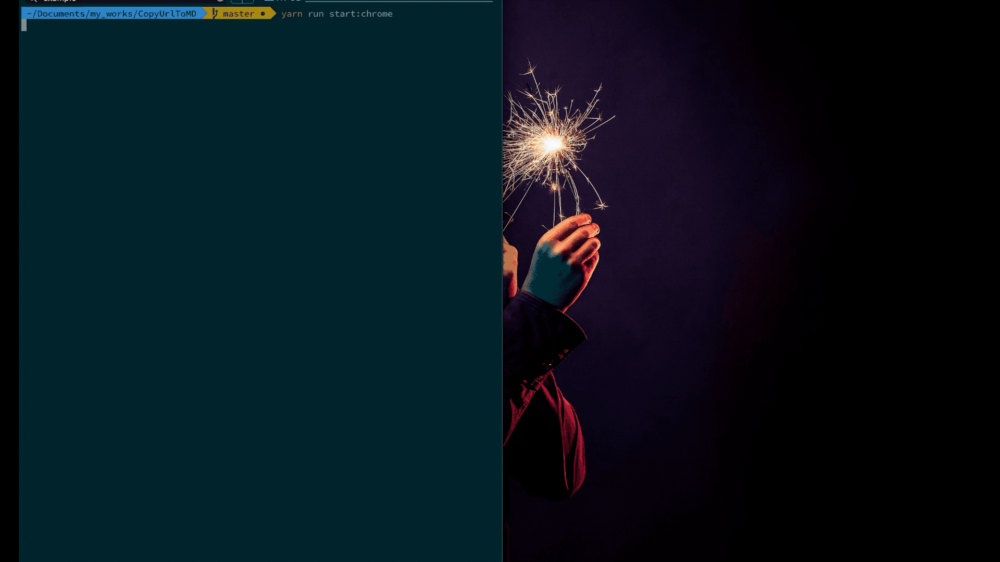

# CopyUrlToMD

Built from [kryptokinght/react-extension-boilerplate](https://github.com/kryptokinght/react-extension-boilerplate)

CopyUrlToMD is a utility browser extension to help you copy the URL of certain tabs into your system clipboard with Markdown-formatted.


## Downloads

[CopyUrlToMD - Chrome Web Store](https://chrome.google.com/webstore/detail/copyurltomd/abgbcgpkejdjlhobkhpcnnlpnbacenfj) 


## Usage

1. install [CopyUrlToMD - Chrome Web Store](https://chrome.google.com/webstore/detail/copyurltomd/abgbcgpkejdjlhobkhpcnnlpnbacenfj) 
2. clicking on the icon or by pressing  `⌥+c` in macOS, `alt+c` in Windows


## Development

1. You need [**Node.js**](https://nodejs.org/en/) installed or using [**nvm**](https://github.com/creationix/nvm#installation) (recommended) running LTS version of Node.js
2. You nedd [**Yarn**](https://yarnpkg.com/en/docs/install)

### Retrieve Code

```bash
# clone the git repo
$ git clone https://github.com/sss63232/CopyUrlToMD.git

# Install dependencies
$ cd CopyUrlToMD && yarn
```
### Run

```shell
# build files to './dev' and launch the web extension in a new chrome instance.
$ npm run start:chrome
# launches in firefox
$ npm run start:mozilla
# runs storybook
$ npm run storybook
```

`npm run chrome-launch` in action:



* If you want to load your unpacked extension by yourself, then run `npm run dev`. This will create the extension inside an **dev** folder in `development` mode and will watch the `src` folder for changes.   
* [Load unpacked extensions](https://developer.chrome.com/extensions/getstarted#unpacked) with `./dev` folder. Though you have to reload the extension by yourself every time the `./dev` folder updates.


## Build

```bash
# build files to './extension'
$ npm run build
```


## Contributing

To get an idea about the structure of the project, [read here](CODETOUR.md).
Contributions are highly welcome. Please take some time to read the guidelines mentioned here [contribute](CONTRIBUTING.md).


## License

[MIT license](LICENSE).


## Created By

If you like this, follow me on [New's News](https://blog.newtchen.me/) 

